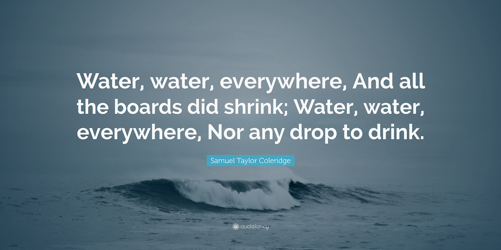

# About
A webpage with an educational quiz to teach about water sustainability

## Explanations of the technologies used
- Bootstrap
- DOM manipulation 

## Approach taken 
- Content based on actual live workshop done by me
- Layout, Typography, Colours
- Navigation: arrow keys, enter key, hamburger with side menu
- Responsive design using Bootstrap
- Gamification
- Interactivity 
- Animations

## Link to live site
https://pages.git.generalassemb.ly/lthben/water-future/

## Unsolved problems, etc